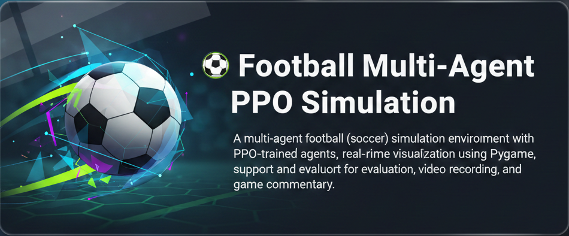

# ⚽ Football Multi-Agent PPO Simulation


## A multi-agent football (soccer) simulation environment with PPO-trained agents, real-time visualization using Pygame, and support for evaluation, video recording, and game commentary.

---
[](LICENSE)


[](https://github.com/ryo-ma/github-profile-trophy)

---

## 📁 Project Structure

```
football-sim/
├── agents/
│   └── ppo_agent.py          # PPO agent definition
├── environments/
│   └── football_ENV.py       # PettingZoo-compatible football environment
├── training/
│   └── train.py              # PPO training loop
├── utils/
│   └── rollout.py            # Evaluation utilities
├── visualization/
│   └── visualize.py          # Pygame-based real-time match rendering
├── main.py                   # Command-line launcher
└── README.md                 # This file
```

---

## 🚀 Features

- Multi-agent football simulation (3v3)
- PPO agent training with torch + PettingZoo
- Pygame-based animation with:
  - Mini scoreboard UI (per team goals)
  - Match timer (step clock)
  - Keyboard controls (`R` to reset, `ESC` to exit)
  - Game recording to `.mp4`
- Optional enhancements:
  - Agent trails (coming soon)
  - End-of-match stats
  - Simple commentary engine ("Goal!" / "Pass!")

---
## Execution

Please refer to footbal_sim.mp4 in project directory
---

## 🧠 Requirements

```bash
pip install torch pettingzoo pygame imageio numpy
```

---

## 🏁 Run the Project

### Train agents:
```bash
python main.py --mode train --episodes 100
```

### Evaluate trained agent:
```bash
python main.py --mode evaluate --model_path trained_agent.pth --episodes 10
```

### Visualize match (with Pygame):
```bash
python main.py --mode visualize
```

---

## 🎮 Keyboard Controls in Pygame

| Key     | Action                  |
|---------|--------------------------|
| `ESC`   | Quit visualization       |
| `R`     | Restart game             |
| `S`     | Start/Stop video recording |

---

## 📦 Output

- Training saves model to `trained_agent.pth`
- Visualization can save gameplay as `football_sim.mp4`

---

## ✨ Credits

Built using:
- [PyTorch](https://pytorch.org/)
- [PettingZoo](https://www.pettingzoo.ml/)
- [Pygame](https://www.pygame.org/)
- [ImageIO](https://imageio.readthedocs.io/)

---

## 📌 TODO

- Player trails
- Possession heatmap
- Commentary engine
- End-of-match stats panel

---

## 🧑‍💻 Author

Made with ❤️ by Soham
